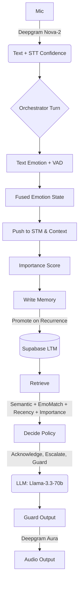

<div align="center">
  <h1>🎙️ VOXERA</h1>
  <p><b>Voice-Based Agentic AI Receptionist Platform</b></p>
  <p>Real-time voice agent routing <b>Deepgram STT + TTS</b> through a hierarchical, emotion-conditioned memory system powered by <b>Supabase `pgvector`</b> and an emotion-aware LLM policy layer.</p>

  [](https://nextjs.org/)
  [](https://supabase.com/)
  [](https://deepgram.com/)
  [](https://groq.com/)
</div>

---

## 🚀 Features

- **🧠 Production Vector Memory:** Replaced local in-memory stores with `pgvector` on Supabase. Implements dynamic semantic routing for Short-Term (STM), Medium-Term (MTM), and Long-Term (LTM) memories.
- **🔐 Multi-Tenant Architecture:** Secure Admin Authentication portal utilizing server-side cookies (`@supabase/ssr`) guaranteeing client data isolation (`clientId`).
- **🗂️ Knowledge Base UI:** Drag-and-drop dashboard for business owners to upload `.txt` and `.pdf` files. The pipeline automatically chunks, embeds, and stores business knowledge for RAG.
- **🎭 Voice Personas:** Dynamically toggle AI personalities (Professional, Friendly, Emphatic, Casual) via the admin dashboard, mapping directly to Deepgram TTS acoustic models.
- **📈 Real-Time Analytics:** Dashboard visualizing the Commitment Acoustic Index (CAI), user emotional states (VAD tracking), escalation triggers, and tool invocations.
- **🛠️ Automated Workflows:** Integrated tool-calling for intelligent calendar availability checks, reservation creation, and live email confirmation dispatches via the **Resend SDK**.

---

## 🔄 Core Pipeline



## 🧮 Acoustic & Semantic Scoring

The platform evaluates real-time conversational significance utilizing advanced decay formulas.

- **Importance Scoring**: 
  `I = α·intensity + β·ΔVAD_user + γ·novelty + δ·recurrence + ε·taskCriticality + ζ·policyFlag`
- **Retrieval Math**: 
  `score = w1·cos(q,m) + w2·EmoMatch + w3·exp(−Δt/τ_I) + w4·I(m) − w5·stale − w6·redund`
  *With Emotion-adaptive decay:* `τ_I = τ₀(1 + λ·I)`

---

## 💻 Local Setup & Deployment

> [!IMPORTANT]
> To run this application locally, you will need a Supabase project instance with the `pgvector` extension enabled.

1. **Clone & Install**
   ```bash
   git clone https://github.com/your-username/voxera.git
   cd voxera
   npm install
   ```

2. **Environment Variables**
   Copy `.env.example` to `.env.local` and configure your API keys:
   ```bash
   cp .env.example .env.local
   ```
   *(Requires: `GROQ_API_KEYS`, `DEEPGRAM_API_KEY`, `SUPABASE_URL`, `SUPABASE_SERVICE_ROLE_KEY`, `RESEND_API_KEY`)*

3. **Database Migration**
   Execute the migration script to configure your Postgres instance.
   - Navigate to your Supabase **SQL Editor**.
   - Copy the contents of `sql/migration.sql` and run the script. This will establish the `memories`, `reservations`, and `session_logs` tables along with the `match_memories` RPC function.

4. **Run Development Server**
   ```bash
   npm run dev
   ```
   Visit `http://localhost:3000` to interact with the Voice Agent, or navigate to `http://localhost:3000/admin` to access the secured dashboard.

---

## 📁 Directory Architecture

| Path | Description |
|------|-------------|
| 📂 `lib/types.ts` | Core interfaces (`Utterance`, `MemoryRecord`, `PolicyDirectives`, `VAD`). |
| 📂 `lib/emotion/` | VAD fusion, trajectory analysis, Commitment Acoustic Index (CAI), and importance engine. |
| 📂 `lib/memory/` | STM ring buffer, Supabase `pgvector` writer (merge/promotion) & MMR retrieval algorithms. |
| 📂 `lib/agent/` | Dynamic LLM system prompt assembler, tool orchestration, and anti-hallucination guard rails. |
| 📂 `lib/deepgram/`| Real-time WebSocket wrappers for STT and HTTP TTS logic. |
| 📂 `app/api/` | Next.js 16 App Router handlers bridging the client stream to the orchestrator. |
| 📂 `app/admin/` | Secure multi-tenant SSR portal containing analytics, settings, and the RAG document uploader. |

---

<div align="center">
  <p><i>Engineered for robust, hallucination-resistant voice workflows.</i></p>
</div>
